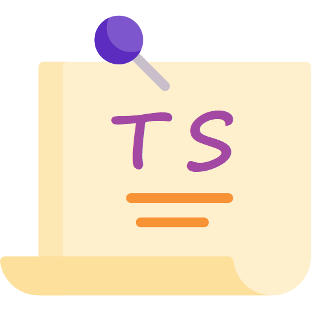

<!--
*** Thanks for checking out the react-ts-todolist. If you have a suggestion
*** that would make this better, please fork the repo and create a pull request
*** or simply open an issue with the tag "enhancement".
*** Thanks again! Now go create something AMAZING! :D
***
*** To avoid retyping too much info. Do a search and replace for the following:
*** github_username (that is "windsuzu"), repo_name (that is "react-ts-todolist"), project_title, project_description
-->

<!-- [![Issues][issues-shield]][issues-url] -->
<!-- [![PR Welcome][pr-welcome-shield]](#contributing) -->
[![Contributors][contributors-shield]][contributors-url]
[![MIT License][license-shield]][license-url]
[![Author][author-shield]][author-url]
[![LinkedIn][linkedin-shield]][linkedin-url]

<!-- PROJECT LOGO -->
 

  

  <h3 align="center">React TypeScript Todo List</h3>

  

    A simple todo list program demonstrating how to apply TypeScript to a React project.
     
    <a href="https://windsuzu.github.io/react-ts-todolist">View Demo</a>
    ·
    <a href="https://github.com/windsuzu/react-ts-todolist/issues">Report Bug</a>
    ·
    <a href="https://github.com/windsuzu/react-ts-todolist/issues">Request Feature</a>
  

Table of Contents

* [About](#about)
* [Examples](#examples)
* [Preview](#preview)
* [License](#license)
* [Contact](#contact)
* [Acknowledgements](#acknowledgements)

---

<!-- ABOUT THE PROJECT -->
## About

<table>
<tr>
<td>

這個專案主要示範如何使用 TypeScript。內容包括開發 react.js 及 redux，內容包括:

1. Creating a React + TypeScript Project
   * [`npx create-react-app app_name --template typescript`](https://create-react-app.dev/docs/adding-typescript/)
2. TypeScript + React Components (`props`, `children`, etc)
3. TypeScript + React Hooks (`useState`, `useRef`, `useEffect`, etc)
4. TypeScript + State Management (`useContext` / `Redux`)
5. TypeScript + styled-components

**Built With**

* HTML5, CSS3, Javascript ES6
* TypeScript
* React.js
* styled-components
* redux, @reduxjs/toolkit, react-redux

**DEMO**

* https://windsuzu.github.io/react-ts-todolist

</td>
</tr>
</table>

---

## Examples

## Preview

  <!-- 
  
  
  
  
   -->

---

## License

Distributed under the MIT License. See [LICENSE](https://github.com/windsuzu/react-ts-todolist/blob/main/LICENSE) for more information.

## Contact

Reach out to the maintainer at one of the following places:

* [GitHub discussions](https://github.com/windsuzu/react-ts-todolist/discussions)
* The email which is located [in GitHub profile](https://github.com/windsuzu)

## Acknowledgements

* [Maximilian Schwarzmüller](https://www.udemy.com/user/maximilian-schwarzmuller/)

[contributors-shield]: https://img.shields.io/github/contributors/windsuzu/react-ts-todolist.svg?style=for-the-badge
[contributors-url]: https://github.com/windsuzu/react-ts-todolist/graphs/contributors
[issues-shield]: https://img.shields.io/github/issues/windsuzu/react-ts-todolist.svg?style=for-the-badge
[issues-url]: https://github.com/windsuzu/react-ts-todolist/issues
[license-shield]: https://img.shields.io/github/license/windsuzu/react-ts-todolist.svg?style=for-the-badge&label=license
[license-url]: https://github.com/windsuzu/react-ts-todolist/blob/main/LICENSE
[linkedin-shield]: https://img.shields.io/badge/-LinkedIn-black.svg?style=for-the-badge&logo=linkedin&colorB=555
[linkedin-url]: https://linkedin.com/in/windsuzu
[pr-welcome-shield]: https://shields.io/badge/PRs-Welcome-ff69b4?style=for-the-badge
[author-shield]: https://shields.io/badge/Made_with_%E2%9D%A4_by-windsuzu-F4A92F?style=for-the-badge
[author-url]: https://github.com/windsuzu
